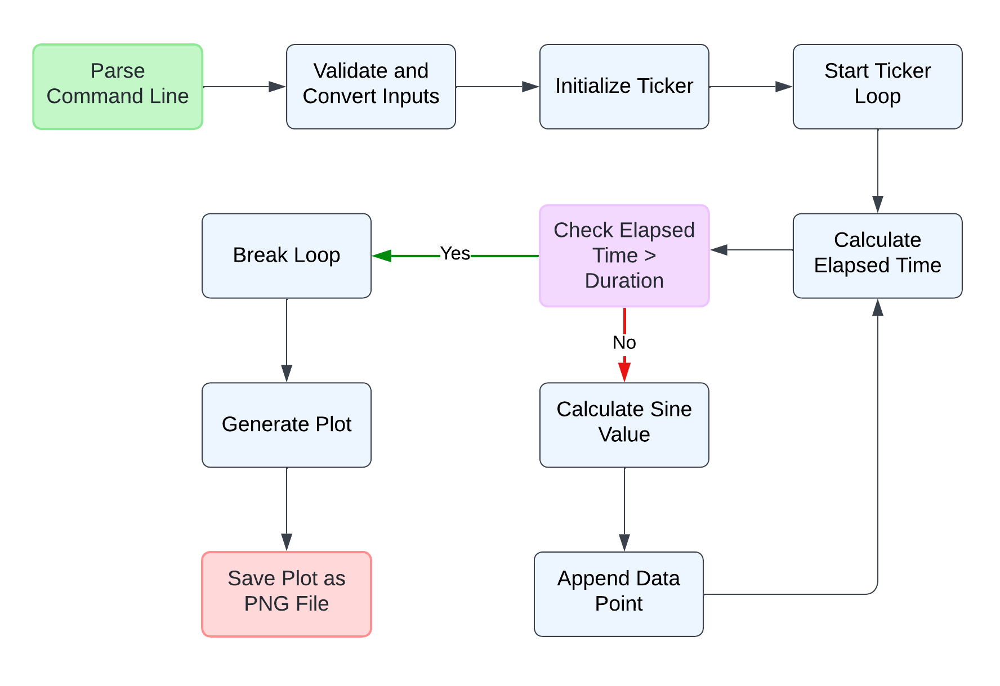
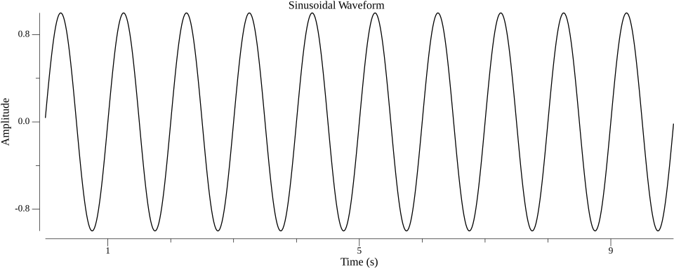

# Sinusoidal Wave Generation Using Go

## Overview

This project demonstrates how to generate and plot a sinusoidal wave in real-time using the Go programming language. The wave is generated using a ticker to simulate real-time data collection and is plotted and saved as a PNG image using the Gonum/Plot library.

## Introduction

### Oscilloscope
An oscilloscope is an electronic device that visually displays varying signal voltages, usually as a two-dimensional graph of one or more electrical potential differences using the vertical axis (y) and time on the horizontal axis (x).

### Sinusoidal Wave
A sinusoidal wave is a continuous wave that describes a smooth periodic oscillation, characterized by its amplitude, frequency, and phase.

**Formula**: 
\[ y(t) = A(sin(2*pi*f*t + phi)) \]

Where:
- \( A \) is the amplitude,
- \( f \) is the frequency,
- \( t \) is the time,
- \( phi \) is the phase angle.

### Go's Ticker Library
Go's `ticker` library from the `time` package generates periodic ticks at specified intervals, useful for triggering events at regular time periods.

## Components

- **Inputs**:
  - Frequency (Hz): Determines the rate of oscillation.
  - Duration (Seconds): Specifies the time span for wave generation.
- **Outputs**:
  - Sinusoidal Wave Plot: Saved as a PNG file (`sinusoidal.png`).
- **Libraries**:
  - Gonum/Plot: Used for creating and saving the plot.
- **Modules**:
  - Go module for dependency management.

## Prerequisites

- Go (version 1.16 or later)

## Setup Instructions

1. **Clone the Repository**:
    ```bash
    git clone https://github.com/yourusername/wave.git
    cd wave
    ```

2. **Initialize Go Module**:
    ```bash
    go mod init wave
    ```

3. **Install Gonum/Plot Library**:
    ```bash
    go get -u gonum.org/v1/plot/...
    ```

## Usage

To run the program, use the following command:

```bash
go run main.go <frequency in Hz> <duration in seconds>
```

Example: 
```bash
go run main.go 1 10
```

This command generates a sinusoidal wave with a frequency of 1 Hz and a duration of 10 seconds, then saves the plot as sinusoidal.png.

## Explanation
- **Command-Line Argument Parsing**: Reads and validates the frequency and duration inputs.
- **Ticker Initialization**: Sets up a ticker to generate ticks at 1ms intervals.
- **Data Collection**: On each tick, the elapsed time and corresponding sine value are calculated and stored.



- **Plotting**: Uses Gonum/Plot to create a plot from the collected data points. Saves the plot as a PNG file.



## References

- **Oscilloscope**: [Oscilloscope - Wikipedia](https://en.wikipedia.org/wiki/Oscilloscope)
- **Go's Ticker Library**: [time.Ticker - Go Official Documentation](https://pkg.go.dev/time#Ticker)


Thank you for exploring this repository!


